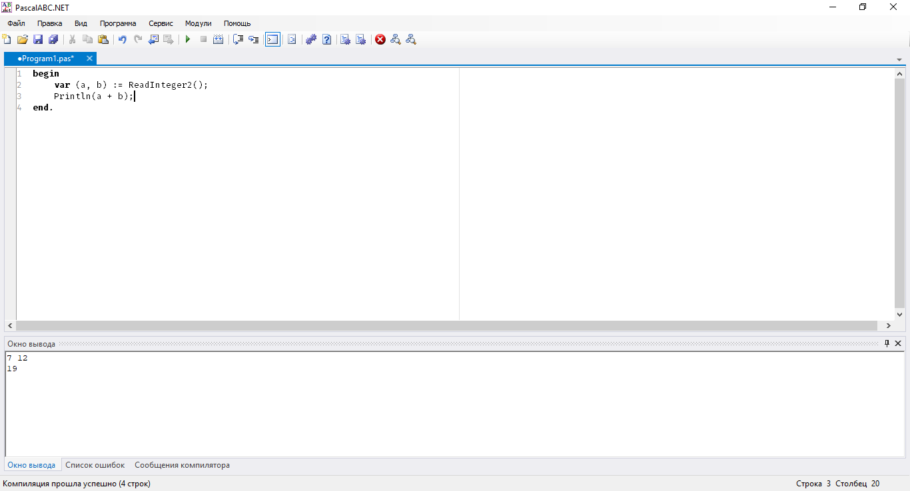

# PascalSharp (Pascal#) Lite IDE
Lite (non-VisualStudio-based) IDE for Pascal#. Windows only IDE, provides facilities to simplify Windows Forms / WPF development.

## PascalABC.NET
It is the logical continuation of PascalABC.NET project (formely VisualPascalABC) from Pascal#. The project is not in active development focus, as Visual Studio MEF provides much more appealing features for IDE.

## Building
Pascal# and its IDE are being developed in Visual Studio Community 2017. Use IDE or MSBuild command line to build Pascal# solution. Do not forget to add `/restore` command line key to MSBuild.

This project is Windows-only, there is no point in trying to compile it under UNIX-like OS, as it relies on WPF. Currently there are no plans to port it to Linux or macOS.

## 3rd-party libraries
* DockPanelSuite
* log4net
* Mono.Cecil
* Microsoft.Build
* SharpDisasm

License status is still to be determined.

## Plugins
There is a bunch of plugins located under *LitePlugins* directory, their usefullness is to be determined. Only select few will actually ship with Pascal# RTM.